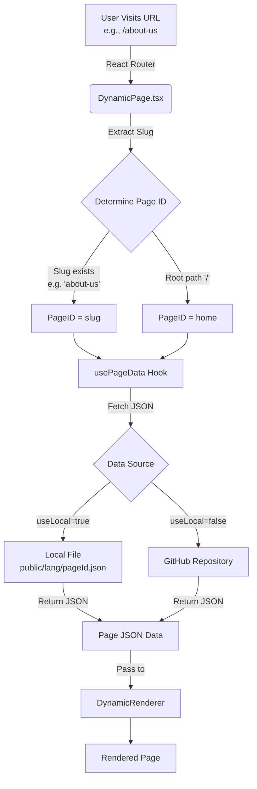

# Integration Guide

This guide covers the installation of `SankhyaUI` in a new Vite React application and the implementation of key components for a dynamic content-driven architecture.

## 1. Installation

To start using SankhyaUI in your Vite React project, install the package using your preferred package manager.

```bash
# Using npm
npm install @sankhyatronics/sankhya-ui

# Using pnpm
pnpm add @sankhyatronics/sankhya-ui

# Using yarn
yarn add @sankhyatronics/sankhya-ui
```

Ensure you also have the necessary peer dependencies installed (React, React DOM, React Router, Tailwind CSS).

## 2. Core Components & Hooks

To build a dynamic application with SankhyaUI, you need to set up three key pieces:
1.  **`usePageData.ts`**: A hook to fetch content.
2.  **`Shell.tsx`**: The main layout component.
3.  **`DynamicPage.tsx`**: The component that renders pages based on routes.

### `usePageData.ts`
This hook centralizes data fetching for your application. It supports switching between local development files and remote GitHub content.

Create `src/hooks/usePageData.ts`:

```typescript
import { useState, useEffect } from 'react';
import { fetchGithubContent, fetchLocalContent, useUser, type PageContent } from '@sankhyatronics/sankhya-ui';

// Toggle this to switch between local (public folder) and remote (GitHub) content
const useLocal = false; 

export function usePageData(pageId: string) {
    const [data, setData] = useState<PageContent | null>(null);
    const [loading, setLoading] = useState(true);
    const [error, setError] = useState<string | null>(null);
    const { language } = useUser();

    useEffect(() => {
        async function fetchPage() {
            setLoading(true);
            setError(null);
            try {
                let result;
                if (useLocal) {
                    // Fetches from /public/{lang}/{pageId}
                    result = await fetchLocalContent(pageId, { lang: language });
                } else {
                    // Fetches from a GitHub repository
                    // Update 'owner', 'repo', and 'path' to match your content repository
                    result = await fetchGithubContent(
                        "<owner>", 
                        "<repo>", 
                        `<path-to-content/${language}/${pageId}`, 
                        { branch: "<branch>" }
                    );
                }
                setData(result);
            } catch (err: any) {
                console.error('Failed to fetch page data:', err);
                setError(err.message || 'Failed to load page');
            } finally {
                setLoading(false);
            }
        }

        if (pageId) {
            fetchPage();
        }
    }, [pageId, language]);

    return { data, loading, error };
}
```

### `Shell.tsx`
The Shell serves as the main layout wrapper. It includes global providers and renders the Header, Footer, and other site-wide components like Cookie Consent.

Create `src/components/Shell.tsx`:

```typescript
import React from 'react';
import { DropdownProvider, DynamicRenderer, useUser } from '@sankhyatronics/sankhya-ui';
import { Outlet } from 'react-router';
import { usePageData } from '../hooks/usePageData';

export const Shell: React.FC = () => {
    const { language, setLanguage, toggleTheme } = useUser();

    // Fetch global content
    const { data: headerData } = usePageData('header.json');
    const { data: footerData } = usePageData('footer.json');
    const { data: cookieConsentData } = usePageData('cookie-consent.json');

    // Define handlers for dynamic components (e.g., buttons in header/footer)
    const handlers = {
        onThemeChangeClick: () => toggleTheme(),
        onLanguageChangeToEn: () => setLanguage('en'),
        onLanguageChangeToDk: () => setLanguage('dk')
    };

    // Extract config from fetched data (simplified for brevity)
    const headerConfig = React.useMemo(() => {
        if (!headerData) return null;
        return Array.isArray(headerData) ? headerData.map((s: any) => s.data) : [];
    }, [headerData]);

    const footerConfig = React.useMemo(() => {
        if (!footerData) return null;
        return Array.isArray(footerData) ? footerData[0]?.data : null;
    }, [footerData]);

    const cookieConsentConfig = React.useMemo(() => {
        if (!cookieConsentData) return null;
        return Array.isArray(cookieConsentData) ? cookieConsentData[0]?.data : null;
    }, [cookieConsentData]);

    return (
        <div className="flex flex-col min-h-screen bg-primary">
            <DropdownProvider>
                <DynamicRenderer config={headerConfig} handlers={handlers} />
            </DropdownProvider>
            
            <main className="flex-1 w-full">
                {/* Renders the child route (DynamicPage) */}
                <Outlet />
            </main>

            {footerConfig && <DynamicRenderer config={footerConfig} />}
            {cookieConsentConfig && <DynamicRenderer config={cookieConsentConfig} />}
        </div>
    );
};
```

### `DynamicPage.tsx`
This component handles routing and renders the specific content for each page. It uses the URL slug to fetch the corresponding JSON configuration.

Create `src/pages/DynamicPage.tsx`:

```typescript
import React from 'react';
import { useParams, useLocation } from 'react-router';
import { DynamicRenderer } from '@sankhyatronics/sankhya-ui';
import { usePageData } from '../hooks/usePageData';

export const DynamicPage: React.FC = () => {
    const { slug } = useParams<{ slug?: string }>();
    const location = useLocation();

    // Determine page ID: 'home' for root path, otherwise use slug
    const initialPageId = location.pathname === '/' ? 'home' : (slug || 'home');
    const [activePageId, setActivePageId] = React.useState(initialPageId);

    React.useEffect(() => {
        setActivePageId(initialPageId);
    }, [initialPageId]);

    // Fetch page content
    const { data, loading, error } = usePageData(`${activePageId}.json`);

    // Handle 404s: Fallback to 'not-found' if fetch fails
    React.useEffect(() => {
        if (error && activePageId !== 'not-found.json') {
            setActivePageId('not-found');
        }
    }, [error, activePageId]);

    if (loading) return <div>Loading...</div>;
    if (!data) return null;

    return (
        <div className={`page-${activePageId}`}>
            {data.map((section, index) => (
                <DynamicRenderer key={index} config={section.data} />
            ))}
        </div>
    );
};
```

---


### Rendering Flow Requirement
The following diagram illustrates how the URL, `DynamicPage`, and `usePageData` work together to render content:



---

## 3. Data Source Options


The `usePageData` hook offers two flexible ways to source your application's content.

### Option A: Local Files (Public Folder)
Ideal for development or self-contained deployments.

1.  Set `useLocal = true` in `usePageData.ts`.
2.  Data is fetched using `fetchLocalContent`.
3.  Place your JSON files in the `public` folder of your React app.
    *   Structure: `public/{language}/{pageId}.json`
    *   Example: `public/en/home.json`, `public/dk/about-us.json`

### Option B: GitHub (Remote Content)
Ideal for fetching content from a CMS repository or allowing content updates without rebuilding the app.

1.  Set `useLocal = false` in `usePageData.ts`.
2.  Data is fetched using `fetchGithubContent`.
3.  You must verify the parameters passed to `fetchGithubContent`:
    *   **Owner**: The GitHub username or organization (e.g., `"sankhyatronics"`).
    *   **Repo**: The repository name (e.g., `"sankhyaCMS"`).
    *   **Path**: The path within the repo to the JSON files (e.g., `"Sample/public/${language}/${pageId}"`).
    *   **Branch** (optional): The branch to fetch from (defaults to `main` or you can specify `dev`).

> **Note**: `fetchGithubContent` uses the raw GitHub user content API, so ensure your repository is public or you have the necessary access tokens configured if using a private repo (though the default helper is typically for public data).

## 4. Application Entry Point (`App.tsx`)

Finally, wire everything together in your `App.tsx`. You must wrap your application with `UserProvider` to manage global state like language and theme, which are used by `Shell` and `usePageData`.

```typescript
import { Route, Routes } from 'react-router';
import { UserProvider, ScrollToTop } from '@sankhyatronics/sankhya-ui';
import { Shell } from './components/Shell';
import { DynamicPage } from './pages/DynamicPage';

const App = () => (
  // Configure available languages and themes here
  <UserProvider 
      defaultLanguage="en" 
      defaultTheme="light" 
      languages={['en', 'dk']} 
      themes={['light', 'dark', 'lavender']}
      storageKeyPrefix="app-"
  >
    <ScrollToTop />
    <Routes>
      <Route element={<Shell />}>
        {/* Home route */}
        <Route path="/" element={<DynamicPage />} />

        {/* Dynamic route for all other pages */}
        <Route path="/:slug" element={<DynamicPage />} />

        {/* Catch-all for 404s */}
        <Route path="*" element={<DynamicPage />} />
      </Route>
    </Routes>
  </UserProvider>
);

export default App;
```

